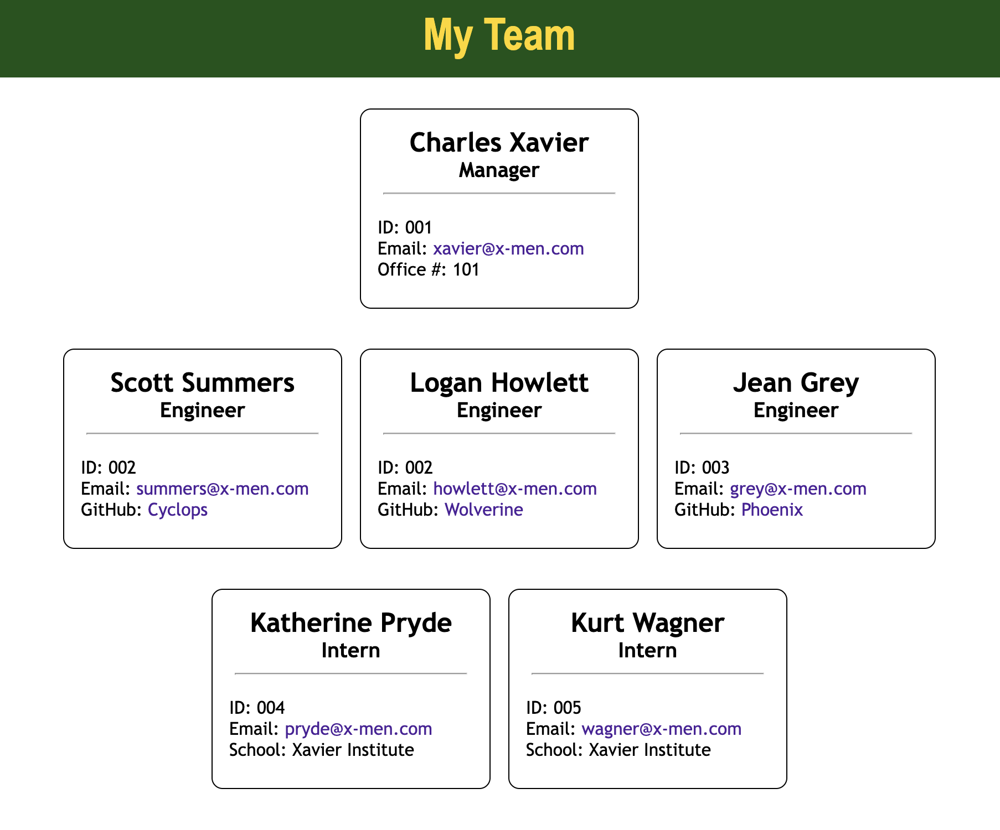

# Team Profile Generator
## Purpose
CLI application that prompts user for information to generate an HTML file to display team information.
## Built With
- HTML
- CSS
- Node.js
- Inquirer
- Jest
## Installation
To install this application, the following steps must be taken:
1. Install Node.js
2. Clone this repository
3. Access repository directory through terminal
4. Install Inquirer: 
```
npm install inquirer
```
## Usage
1. Run the application with:
```
node index.js
```
2. Answer the prompts
3. Access your newly created HTML and accompanying CSS files in the 'dist/' directory
## Tests
1. install Jest:
```
npm install jest
```
2. Run tests: 
```
npm run test
```
## Walkthrough
Please click on the image to be redirected to a walkthrough video

[](https://drive.google.com/file/d/1WBJzrtLSR_jEw93hcJDpdMRfLX8_QlTh/view?usp=sharing)
## Contribution
Created by CSM